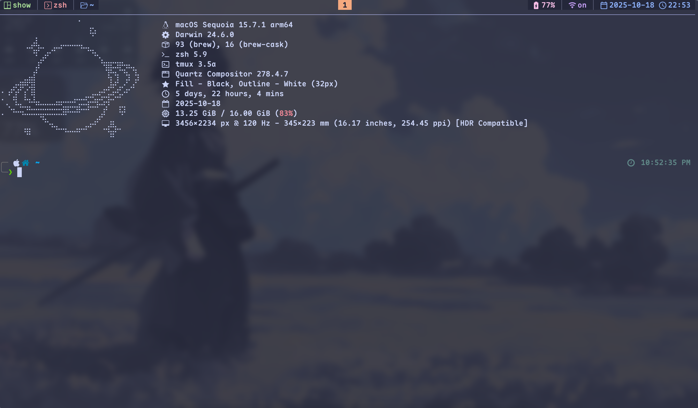

# Baohuamap's Dotfiles

This dotfiles repository contains comprehensive configurations for a modern development environment with a focus on productivity, theming consistency, and seamless integration between tools.

### Core Shell Environment (Zsh)

**Why Zsh?** Because life's too short for a boring shell. Zsh, with Powerlevel10k, gives me a prompt that's not just pretty, but smart. It tells me what I need to know (git status, current directory, system info) without me even asking. FZF integration? That's for when I'm too lazy to type full paths, letting me fuzzy-find files and directories like a pro. Plugins for git, syntax highlighting, and autosuggestions mean less typing, fewer errors, and more time for coffee. And `thefuck`? Because even senior devs make typos, and I'm not about to retype a long command. Zoxide are just quality-of-life upgrades for navigating directories without thinking.


### Terminal Multiplexing (Tmux)

**Why Tmux?** Because one terminal isn't enough, and I'm not a fan of juggling windows. Tmux lets me create persistent sessions, so if my laptop crashes (it happens), I can pick up exactly where I left off.

### Terminal Emulator (Wezterm)

**Why Wezterm?** Because I demand speed and beauty from my terminal. GPU acceleration means a buttery-smooth experience, even with fancy effects.

### Text Editor (Neovim)

**Why Neovim?** Because a good editor is an extension of my brain. Neovim, especially with LazyVim, gives me a powerful, extensible environment that's fast and efficient.

### File Viewing & Syntax Highlighting (Bat)

**Why Bat?** Because `cat` is boring and `less` is too basic. Bat is like `cat` but on steroids: beautiful syntax highlighting, git integration to see changes at a glance, and line numbers.

### Additional Tools

**Why these extras?** Because a well-rounded toolkit makes life easier. `btop` and `htop` are my go-to for quick system health checks. `eza` is a modern `ls` replacement that's faster and prettier. `fastfetch` gives me a quick, customizable overview of my system. `fzf-git.sh` streamlines my git commands. And the custom scripts in `.scripts/`? Those are my personal automations, saving me precious keystrokes and brainpower for more important things.

### Design Philosophy

The configuration emphasizes:
- **Consistent Catppuccin theming** across all tools for visual cohesion
- **Keyboard-driven workflows** with extensive custom keybindings
- **Integration between tools** (e.g., FZF with fd, tmux with vim navigation)
- **Performance optimization** with lazy loading and efficient backends
- **Modern development practices** with current path awareness and smart defaults

## Installation

These dotfiles are managed using a bare Git repository, which allows for easy management and deployment.

### Prerequisites

Before proceeding, ensure you have the following installed:

- **Git**: For cloning the repository.
- **Zsh**: The primary shell used in this configuration.
- **Wezterm**: The recommended terminal emulator.
- **Neovim**: The configured text editor.
- **Tmux**: For terminal multiplexing.
- **Homebrew (macOS)** or equivalent package manager (Linux): For installing various tools and dependencies.

### Steps

1.  **Clone the repository**:
    Open your terminal and clone the bare repository into a hidden directory in your home folder:

    ```bash
    git clone --bare https://github.com/baohuamap/.dotfiles.git $HOME/.dotfiles
    ```

2.  **Run make install**:
    Run the installation script to set up the dotfiles and configure your environment:

    ```bash
    make install
    ```

3.  **Install dependencies (e.g., using Homebrew on macOS)**:
    Install necessary tools and fonts. This example uses Homebrew, adjust for your OS/package manager.

    ```bash
    # Example for macOS
    brew install zsh wezterm neovim tmux bat eza fastfetch btop htop fzf thefuck
    brew install --cask font-maple-mono-nerd-font # Or your preferred font
    ```

4.  **Install Zsh plugins**:
    If you are using `oh-my-zsh` or `antigen`, follow their respective instructions to install plugins. For manual installation, clone the plugins:

    ```bash
    # Example for zsh-autosuggestions
    git clone https://github.com/zsh-users/zsh-autosuggestions ${ZSH_CUSTOM:-~/.oh-my-zsh/custom}/plugins/zsh-autosuggestions
    # Example for zsh-syntax-highlighting
    git clone https://github.com/zsh-users/zsh-syntax-highlighting.git ${ZSH_CUSTOM:-~/.oh-my-zsh/custom}/plugins/zsh-syntax-highlighting
    ```

5.  **Install Tmux Plugin Manager (TPM)**:

    ```bash
    git clone https://github.com/tmux-plugins/tpm ~/.tmux/plugins/tpm
    ```
    Then, start a new tmux session and press `prefix + I` (capital i) to install the plugins.

6.  **Set Zsh as default shell**:

    ```bash
    chsh -s $(which zsh)
    ```

7.  **Restart your terminal**:
    Close and reopen your terminal to apply all changes.


## Screenshots

### Wezterm Terminal


*A screenshot of the Wezterm terminal showcasing the Catppuccin theme and custom font.*
